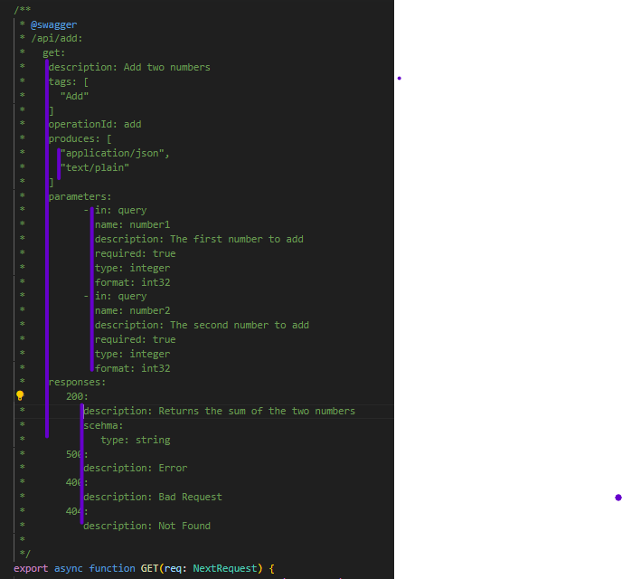
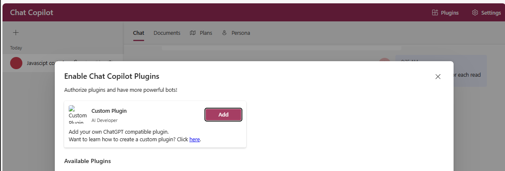

# OpenAi [Next.js] plugin starter

This project provides starter code to create a ChatGPT plugin. It includes the following components:

- An endpoint designed to provide a .well-known/ai-plugin.json file, enabling ChatGPT to identify the plugin.
- A tool that facilitates the generation of API specification files.
- The capability to add new native functions as endpoints within the plugin.
- A feature that allows for API testing directly on web pages and offers visual feedback by embedding it on the page.
- Integration with Adaptive Cards to facilitate testing of card representations and related functionalities. 
- TBD: A feature that can convert visual dynamic components into markdown format.
- TBD: A function to produce dynamic Open Graph images derived from web pages.
 
To learn more about using this starter, see the Semantic Kernel documentation that describes how to [create a ChatGPT plugin](https://learn.microsoft.com/en-us/semantic-kernel/ai-orchestration/chatgpt-plugins).

## Prerequisites 
* https://github.com/microsoft/chat-copilot 
* For this plugin 
    - [Node.js](https://nodejs.org/en)

## Learn More
- To learn more about Next.js, take a look at the following resources:
- [Next.js Documentation](https://nextjs.org/docs) - learn about Next.js features and API.
- [Learn Next.js](https://nextjs.org/learn) - an interactive Next.js tutorial.  
- [Semantic Kernel](https://github.com/microsoft/semantic-kernel)


## Getting Started with running plugin

First, run to install the packages and to genearte the open api swagger json
```bash
npm install 
# or
yarn install  
```

Once you have the APIs in place with appropriate @swagger comments added, run the command below to generate the Swagger JSON file, as per the OpenAPI specification. Make sure to follow the guidelines on adding comments from here. https://github.com/jellydn/next-swagger-doc 
Most importantly, the alignment as per the image is crucial; if not, it fails to generate the Swagger doc.

```
yarn next-swagger-doc-cli next-swagger-doc.json
```

First, run the development server:

```bash
npm run dev -p 9080
# or
yarn dev -p 9080
# or
pnpm dev -p 9080
```

Open below Url's with your browser to see the result.
[http://localhost:9080](http://localhost:9080) 
[http://localhost:9080/.well-known/ai-plugin.json](http://localhost:9080/.well-known/ai-plugin.json)
[http://localhost:9080/swagger.json](http://localhost:9080/swagger.json)


You can start editing the page by modifying `app/page.tsx`. The page auto-updates as you edit the file. 

## Once your plugin is running, ensure that the Chat Copilot is also running ( With this setup, there's no need to wait for the ChatGPT Plus subscription to interact with the local plugin extension. This will enable you to test your plugin immediately using Chat Copilot. )

https://github.com/microsoft/chat-copilot  

Link the plugin by adding it to the custom plugin as demonstrated here
 


After it's linked and Enabled, you can ask questions to it
```
2 + 3
3 * 6 
What is 7 + 9
....
```